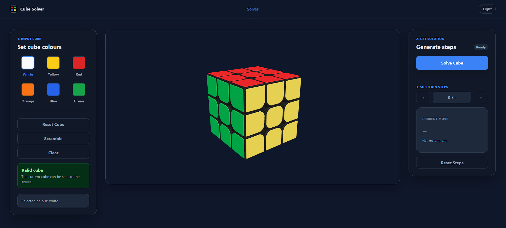
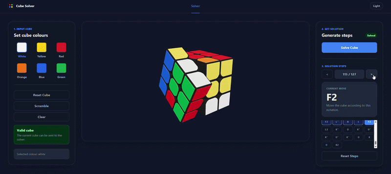

# Rubik’s Cube Solver

An interactive web-based 3x3 Rubik’s Cube solver with colour input, cube validation, a real solving engine, and animated 3D step-by-step playback. Users can enter their cube state, generate a solution, and follow each move visually on a 3D cube model.

## What It Does

Rubik’s Cube Solver is a web app that lets users enter a 3x3 cube state, validate it, solve it, and follow the solution step by step with a 3D cube viewer.

Users can select sticker colours, click stickers on the cube, run the solver, and step through the generated moves while the 3D cube animates each turn.

## Live Demo

Coming soon.

## Why I Built It

I built this project to combine algorithmic problem solving with an interactive visual interface.

The goal was not just to calculate a Rubik’s Cube solution, but to make the solving process easier to follow visually. A normal 2D cube net can be difficult to understand during playback, so the project includes a 3D cube model with animated move transitions.

## Key Features

- Interactive 3x3 Rubik’s Cube input
- Colour selection for cube stickers
- Cube state validation before solving
- Full cube solving workflow
- Step-by-step solution playback
- Animated 3D cube turns for each move
- Light and dark theme support
- Solver runs in a web worker to avoid freezing the UI
- Clean React component structure
- Responsive web UI

## Screenshots

## Tech Stack

- React
- TypeScript
- Vite
- Three.js
- React Three Fiber
- Drei
- CSS
- Web Workers

## How It Works

The app stores the cube as a structured 3x3 state for each face.

The user selects a colour and applies it to stickers on the cube. Before solving, the app validates the cube state to check that the sticker counts and cube structure are usable.

When the user presses the solve button, the cube state is sent to a solver running inside a web worker. This keeps the browser UI responsive while the solving logic runs.

After a solution is generated, the app displays the move sequence and allows the user to move forward or backward through each step. The 3D cube model updates with animated layer rotations so the user can visually follow the solution.

## What I Learned

- How to represent a Rubik’s Cube in code
- How cube moves affect sticker positions
- How to validate cube state before solving
- How to structure a staged solving algorithm
- How to use a web worker for expensive calculations
- How to integrate a 3D model into a React app
- How to animate cube moves in a way that matches solver notation
- How to connect algorithmic logic with a visual UI

## Challenges

One of the biggest challenges was making the solver and the 3D cube stay in sync. It was not enough to simply change sticker colours instantly after each move. The cube needed to rotate like a real cube so users could understand what was happening.

Another challenge was keeping the UI responsive while solving. Some cube states can take longer to solve, so the solver logic was moved into a web worker.

The project also required careful cube validation, because invalid cube states can look correct visually but still be impossible to solve.

## Future Improvements

- Add a Kociemba/two-phase solver for shorter solutions
- Add better error messages for impossible cube states
- Add import/export for cube states

## License

This project is licensed under the MIT License.
